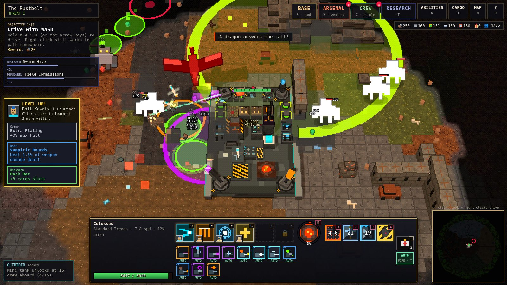
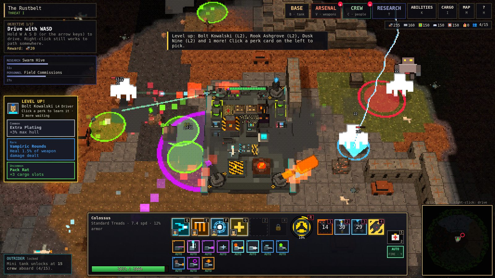
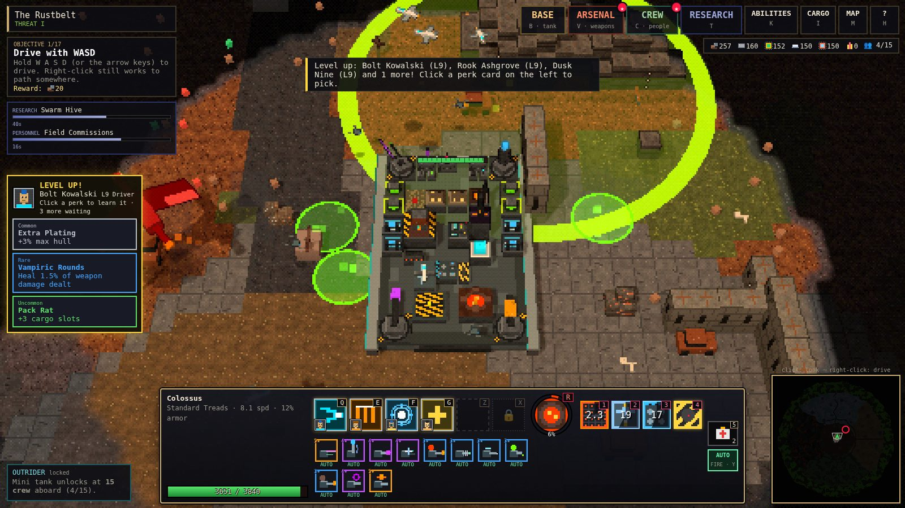
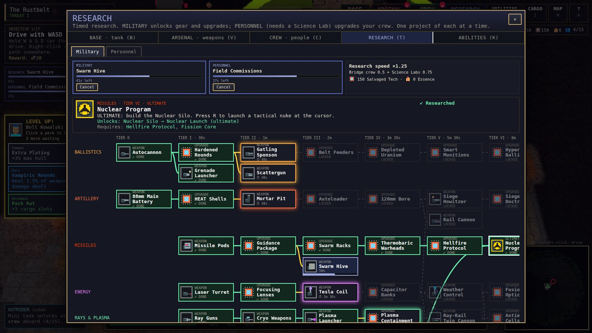
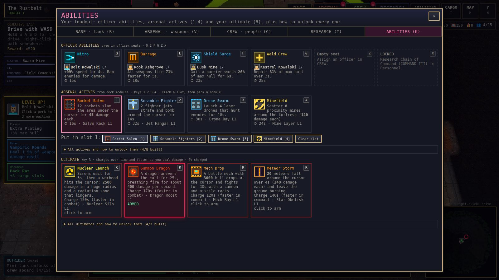
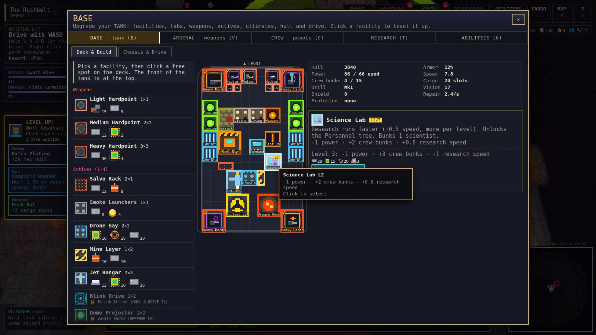
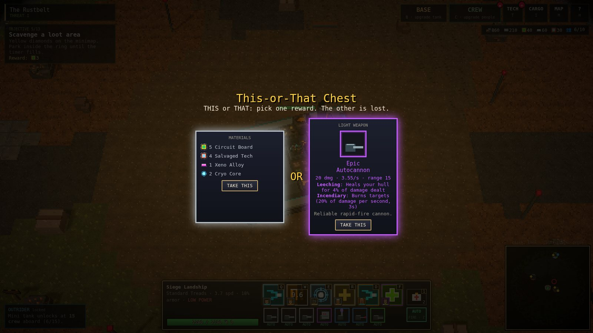
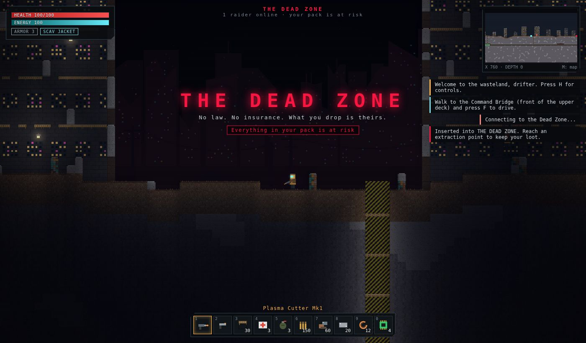
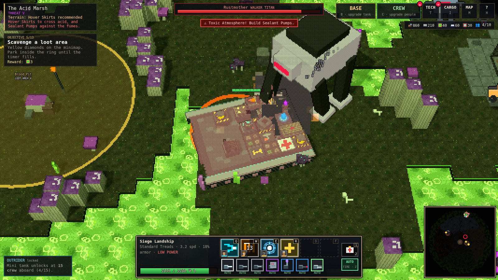
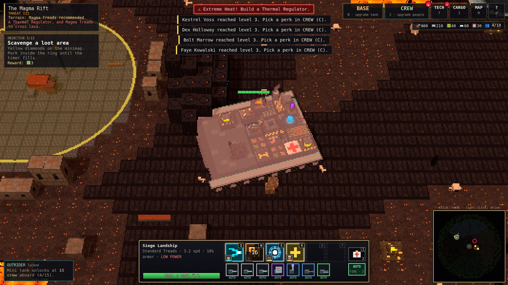

# IRONCRAWL

An overhead 3D, pixel-art wasteland game about commanding a **giant rolling tank-fortress**. Drive it with **WASD** (or right-click like a MOBA). Your guns aim and fire on their own. Officer abilities sit on **Q E F G Z X**, arsenal actives on **1-4** and your **ultimate on R**. The art is chunky 8-bit in the spirit of Terraria.

The base is the tank. You fill its deck with barracks, living quarters, **science labs**, a **weapon forge**, reactors, cargo holds and weapon hardpoints, and grow it from a Light Crawler into a Colossus. The crew who live aboard level up and pick perks.

The arsenal is where it gets strange:
- Grenade and acid launchers, flamethrowers, ray guns, plasma launchers.
- A **Ray-Rail twin cannon** (a rail gun and a death-ray on one turret).
- A turret that launches **mini fighter jets**.
- Storm spires that call lightning from the sky, gravity cannons, a Phoenix Launcher and the Void Lance.
- Ultimates from a **Nuclear Silo** to a **Dragon Roost**.

Every weapon goes from **1★ to 6★ Mythic** and has its own upgrade tree.

Near camp you meet scrap rats and scavengers. Deeper into the wasteland you meet raider tanks, enemy outposts, elites and **titans**. North-east of camp is **the Dead Zone**, a multiplayer warzone where other players can loot your wreck.


| | |
|---|---|
|  |  |
|  |  |
|  |  |
|  |  |
|  |  |
|  |  |

## Quick start

```bash
npm install
npm run dev          # client (Vite, http://localhost:5173) + Dead Zone server (ws on :8787)
```

Open http://localhost:5173 and press **Start**. Single-player only needs the browser. If the Dead Zone can't reach a server (for example when the game is embedded as a single file), you still get an **offline raid against bots**, run in the browser with the same server code.

| Command | What it does |
|---|---|
| `npm run build` | Typecheck and build the client into `dist/` |
| `npm start` | One process for production: serves `dist/` **and** the Dead Zone on `PORT` (default 8787) |
| `npm test` | Unit tests (world gen, pathing, fortress, crew, chests, saves, Dead Zone server rules, arsenal, research, actives and ultimates) |
| `npm run typecheck` | `tsc --noEmit` |

Server environment variables: `PORT`, `WARZONE_SEED` (fixed arena), `WARZONE_BOTS` (AI raiders, default 5).

## Controls

Everything also works with the mouse: the menu buttons at the top right, the ability bar at the bottom, perk cards on the left when someone levels up, and the research/forge widget at the top left.

| Input | Action |
|---|---|
| **W A S D** / arrows | Drive. Screen-relative by default; switch to tank-style (W/S throttle, A/D turn) in the menu. |
| **Right-click** | Drive there. On an enemy: focus fire. On a resource node: harvest it. On a rune, loot area or the gate: go and use it. Hold to keep steering. |
| **Q E F G** (+ **Z X** once researched) | Officer abilities (each has a cooldown). Aimed abilities fire at the cursor. |
| **1 2 3 4** | Arsenal actives: Rocket Salvo, Drone Swarm, Scramble Fighters, Minefield, Blink, Aegis Dome, Carpet Bomb, Smoke |
| **R** | Ultimate: Nuclear Launch, Mech Drop, Orbital Laser, Meteor Storm, Time Stop, Summon Dragon, Cataclysm |
| **5** | Repair kit |
| **Left mouse** | Fire every weapon set to **MANUAL** at the cursor |
| **Y** | Auto-fire on/off for every weapon. Right-click a weapon icon to switch just that one; left-click opens it in the Arsenal. |
| **L** / **Space** | Lock the camera / hold to recenter. The screen edge pans when unlocked. |
| **Wheel** | Zoom |
| **J** | Send the Outrider to the resource node or loot area under the cursor |
| **B** / **V** / **C** / **T** / **K** | BASE (tank) · ARSENAL (weapons) · CREW (people) · RESEARCH · ABILITIES (loadout) |
| **I** / **M** / **H** / **Esc** | Cargo & Workshop · World map · Help · Menu |

## How it plays

### Upgrade your BASE (`B`): things bolted to the tank

- **Deck & Build.** The deck is a grid (7×10 cells on the Light Crawler, 13×21 on the Colossus). Place facilities on it:

  | Group | Facilities |
  |---|---|
  | Command and power | Command Bridge, reactors and a fission core, diesel and ion engines |
  | Crew | Living Quarters and Barracks (bunks), Medbay, Hydroponics, Mess Hall |
  | Labs and facilities | **Science Labs** (research speed, Personnel tree), **Weapon Forge** (star-ups), **Training Grounds** (passive crew XP), **Arcane Sanctum** (Mythic Essence, arcane damage), **Ammo Depot** (fire rate), **Command Uplink** (ultimate charge) |
  | Industry | Cargo Holds, Secure Vault, Refinery, Workshop, Mk2/Mk3 drill rigs, Garage |
  | Defense and hazard gear | Armor, shields, a repair bay, a radar mast, Rad Baffles, Thermal Regulator, Sealant Pumps |
  | Arsenal modules | Light, medium and heavy **hardpoints**, plus the modules that power your **actives** and **ultimate** |

- **Module levels.** Click a facility to level it from L1 to L3. Each level is +50% effect, and bunks gain +1 per level.
- **Chassis & Drive.** Five hulls from Light Crawler to Colossus. Five drive trains: standard treads, dune tracks, spiked chains, magma treads and hover skirts. Each zone needs different gear, and the panel shows what you're missing.

### The ARSENAL (`V`): 35 weapons, 1★ to 6★

- **Stars.** Every weapon has a star level:

  | Stars | Rarity |
  |---|---|
  | 1★ | Common |
  | 2★ | Uncommon |
  | 3★ | Rare |
  | 4★ | Epic |
  | 5★ | Legendary |
  | 6★ | Mythic |

  More stars mean more damage, more fire rate and more trait slots. **Forge** a weapon to add a star. Forging takes time: 20 s for 2★, 6 minutes for 6★. 4★, 5★ and 6★ each need Forge research, and 6★ needs Mythic Essence.
- **Upgrade trees.** Each star is a point in that weapon's own tree. There are three branches (Firepower, Handling, Payload) with three tiers each. The tier-3 capstones depend on the weapon family: Executioner, Double Tap, Overcharge, Chain Reaction, Cluster Payload, Storm Caller, Singularity, Hellfire, Vampiric and Smart Rounds. You can reset a tree for scrap.
- **Families.**

  | Family | Weapons |
  |---|---|
  | Ballistic | Autocannon, Gatling, Grenade Launcher, Scattergun |
  | Artillery | 88mm Main Battery, Mortar, Siege Howitzer (cluster shells), Rail Cannon |
  | Missile & aviation | Missile Pod, Swarm Hive, **Hornet Launcher** (launches mini fighter jets) |
  | Energy | Laser, **Ray Gun** (ramps up on a target), Cryo Blaster (slow/freeze), Tesla Coil, Plasma Launcher, **Ray-Rail Twin Cannon**, Storm Spire (lightning from the sky) |
  | Defense | Flak, Point Defense, Sonic Cannon (stunning cone) |
  | Chemical | Flamethrower, **Acid Launcher** (armor-eating pools), Kraken Launcher (tentacles root enemies), Dragon's Breath |
  | Arcane | Soul Reaper (homing life-drain skulls), Arcane Orb, **Chrono Cannon** (slow-time fields), **Graviton Cannon** (gravity wells), **Phoenix Launcher**, **Void Lance** (erases anything under 20% health) |

- **Exclusives** come only from rune chests and are always 5★ or better: Sunspear, Hydra, Thunderhead, Grinder Maw, Oblivion Mortar, **Stormcaller** and **Starfall Array**.
- **Codex.** The Codex tab lists every weapon and how to get it. Build 1★ copies at a Workshop.

### RESEARCH (`T`): timed, and the deeper the stronger

- **Military tree.** 12 branches: Ballistics, Artillery, Missiles, Energy, Rays & Plasma, Chemical, Arcane, Mythic, Aviation, Defense, Hull & Drive and Industry.
  - It runs from tier 0 to tier VI. Tier I takes 30 s; tier VI takes 8 minutes. The long ones are the nuke, the dragon, the Void Lance and +50% family upgrades.
  - Nodes unlock weapons, facilities, actives and ultimates, or upgrade a whole weapon family or the hull.
- **Personnel tree.** Needs a Science Lab. 6 branches:

  | Branch | What it upgrades |
  |---|---|
  | Command | Officer seats Z and X, ability power, cooldowns, a 4th perk choice |
  | Tactics | Weapon bonuses, and Blitz after abilities |
  | Medical | Recovery, hull regen, Outrider crew always survive |
  | Engineering | Power, hull, shields, forge speed |
  | Arcane Studies | Rune time, cheaper essence, arcane damage, ultimate charge |
  | Logistics | Cargo, better recruits, XP, active cooldowns, research speed |

- **Slots and speed.** One military and one personnel project run at a time. Research costs Salvaged Tech plus materials, paid up front (cancel refunds it). Speed comes from the bridge crew (0.5), plus Science Labs and their levels, plus scientists.

### ABILITIES (`K`): the loadout

- **Officers.** 4 seats at the start (Q E F G). Z and X unlock through Personnel research.
- **Arsenal actives (1-4).** They come from deck modules, and a module's level scales its power:

  | Active | Module |
  |---|---|
  | Rocket Salvo | Salvo Rack |
  | Smoke Screen | Smoke Launchers |
  | Drone Swarm | Drone Bay |
  | Minefield | Mine Layer |
  | **Scramble Fighters** | Jet Hangar |
  | Blink | Blink Drive |
  | Aegis Dome | Dome Projector |
  | Carpet Bomb | Airstrike Beacon |

- **Ultimate (R).** Arm one ultimate module at a time. It charges over time, and up to 3× faster while you deal damage:

  | Ultimate | Module | Research |
  |---|---|---|
  | **Nuclear Launch** (siren, warhead, mushroom cloud, radiation) | Nuclear Silo | Missiles VI |
  | **Mech Drop** | Mech Bay | Aviation V |
  | **Orbital Laser** (steer it with the mouse) | Orbital Uplink | Aviation VI |
  | **Meteor Storm** | Star Obelisk | Mythic V |
  | **Time Stop** | Chrono Engine | Mythic V |
  | **Summon Dragon** | Dragon Roost | Mythic VI |
  | **Cataclysm** | Storm Engine | Mythic VI |

### Upgrade your CREW (`C`): your people

- **Officers (main crew).** Each officer in a seat brings their role's **active ability** with a cooldown:

  | Role | Ability |
  |---|---|
  | Gunner | Barrage |
  | Engineer | Shield Surge |
  | Mechanic | Weld Crew |
  | Medic | Triage |
  | Driver | Nitro |
  | Scavenger | Magnet Sweep |
  | Quartermaster | Artillery Call |
  | Scientist | EMP Pulse |
  | Marine | Drop Squad |

- **Side crew.** Everyone else gives a passive bonus by role.
- **Levels and perks.**
  - When a crew member levels up, **click 1 of 3 perk cards** that pop up on the left of the screen.
  - Perks roll a rarity from Common to **Mythic**.
  - **Veteran perks** unlock at level 5 and **master perks** at level 8. They are much stronger, for example Warlord: +damage, +fire rate and +ability power.
- **Champions** (Legendary) have signature abilities that outclass the basics, like Juggernaut Charge, Orbital Lance or Singularity. **Exclusive characters** (Epic) have unique passives. Both come only from **Rune Chests**.
- **Max 15 aboard.** Once the fortress holds 15 crew you can launch the **Outrider** from a Garage.
  - It's a mini tank crewed by side crew. It follows you and fights.
  - You can send it on **expeditions** to harvest nodes or scavenge loot areas by itself.
  - If it's destroyed, each crew member aboard may die. Medics improve the odds.

### Loot, rarities and chests

- Weapons and perks come in **Common, Uncommon, Rare, Epic, Legendary and Mythic** (1★-6★ for weapons). Rarer weapons hit harder, fire faster and roll bonus traits: Heavy, Rapid, Long-barrel, Incendiary, Piercing, High-yield, Arcing, Keen, Leeching, Frostbitten, Volatile.
- **Mythic Essence** drops from titans, rune chests, deep outposts and Dead Zone supply drops, or you can distil it at an Arcane Sanctum. It powers arcane gear and 6★ forging.
- **Loot areas** (yellow ◆): park inside the ring and hold while defenders attack. They pay out materials, often a weapon, and sometimes a **This-or-That chest**. You pick one of its two rewards and the other is gone.
- **Runes** (colored ●): jungle-camp style. Beat the guardians, then park beside the altar. You get a 90 s buff (Crimson, Azure, Verdant or Gilded) and a **Rune Chest**, which can hold an **exclusive weapon** or an exclusive character. Rarely, it holds a **champion**.
- **Exclusive weapons** are always 5★ or better: Sunspear Lance, Hydra Rack, Thunderhead Coil, Grinder Maw, Oblivion Mortar, Stormcaller and Starfall Array.

### The wasteland

The world is 640×640 tiles in six zones. Danger rises with distance from camp, in tiers I–V:

| Zone | Direction | What you need |
|---|---|---|
| **Rustbelt** | Center | Home turf |
| **Dune Sea** | East | Dune tracks, or you crawl |
| **Cryo Spires** | North | Spiked chains and a Thermal Regulator |
| **Glass Crater** | South | Rad Baffles |
| **Magma Rift** | West | A Thermal Regulator, plus magma treads to cross lava |
| **Acid Marsh** | Outer ring | Hover skirts and Sealant Pumps |

Roads and lava bridges link the zones. You explore under a **fog of war**. Things you'll run into:

- **Raider tanks:** enemy bases on treads, armed with rarity-rolled weapons.
- **Outposts:** fortresses that drop a This-or-That chest and free a prisoner.
- **Titans**, each attack telegraphed on the ground:
  - The **Colossal Walker** stomps and lobs boulders.
  - The **Dread Behemoth** charges.
  - The **Burrow Titan** erupts from below.

### The Dead Zone (multiplayer)

Drive into the gate north-east of camp:

- Loot crates and the supply drops that land in the plaza.
- Fight other commanders and AI raiders.
- To keep what you found, hold position at a green **extraction** beacon for 6 seconds.

If your fortress is destroyed there, you drop your cargo hold (except Vault slots), every spare weapon and one mounted weapon. The drop becomes a wreck that anyone can loot. Leaving mid-raid counts as dying.

The server owns health, damage, deaths, crates and extraction. It caps each reported hit by the weapon's maximum and each attacker's damage per second, and it rejects teleports.

## Tech

- **TypeScript + Vite**, **three.js** for rendering, **ws** for the server, **Vitest** for tests. No image or audio files: every texture, sprite, portrait, icon and sound is generated at startup.
- **8-bit look:** the scene renders at 1/2–1/4 resolution into a render target. A post pass then draws 1-pixel depth outlines and posterizes with ordered dithering, and the result is upscaled with nearest-neighbour filtering.
  - Terrain is voxel chunks built from a procedural 16×16 texture atlas.
  - Tanks are voxel models generated from the deck layout: turrets rotate and treads scroll.
  - Creatures are pixel billboards.
  - Fog of war is a data texture sampled by every world material.
- **Simulation:** fixed 60 Hz steps. Tanks are capsules pathing with A* over a clearance field, so big hulls only take routes they fit through (or drive them directly with WASD).
  - Weapons are projectiles, hitscan beams, chain lightning, homing missiles, lobbed artillery, cones, sky strikes or launched jets.
  - Shots carry on-hit effects: slow, stun/root, pools, splits, gravity wells, execute and the tree capstones.
- **Summons:** jets, drones, mechs, dragons and mines are simulated allies with their own voxel models.
- **Save:** localStorage (`ironcrawl3d-save-v1`, format v4), autosaved every 30 s. Older saves migrate automatically.

```
src/shared/   map, world + arena generation, collision & A*, items, weapons (stars, trees), rarity, loot, protocol, Dead Zone server sim
src/game/     Game state, tank, crew, research, arsenal (actives, ultimates, forge), chests, actions, save, and systems/
              (movement, weapons, projectiles, allies, arsenal, AI, world, crew, outrider, spawns)
src/render/   three.js view + pixel post pass, terrain chunks, voxel models (tanks, turrets, jets, mech, dragon), sprites, particles, fog of war, overlay, minimap, icons
src/ui/       HUD, BASE / ARSENAL / CREW / RESEARCH / ABILITIES / CARGO / MAP panels, chests, title
src/net/      Dead Zone client (WebSocket with an in-browser fallback)
server/       Node host for the Dead Zone (serves dist/ too)
legacy/2d/    the original side-view 2D prototype, kept for reference
```

See [docs/DESIGN.md](docs/DESIGN.md) for the design notes.
