# IRONCRAWL

An overhead 3D, pixel-art wasteland game about commanding a **whole facility on treads**. It plays with mouse and keyboard or on a **phone** (touch stick, taps, drag-and-drop cards). Drive it with **WASD** or the stick: it rolls straight over rocks, ruins and wrecks, and its guns aim and fire on their own. You fight with **battle cards** (drag one onto the battlefield, Clash Royale style), run the inside of your fortress **like a Clash of Clans village**, and level up by **killing things**.

The pieces:
- **Battle cards**, in the spirit of Magic: The Gathering. There are 42 cards in five schools (Iron, Volt, Rust, Void, Aegis) and six rarities, plus 12 permanent **relics**. You hold 4 cards from a deck of 8 and spend energy to play them: artillery, rocket salvos, drop squads, EMP, lightning storms, a dragon, a mech, a nuke. **Card packs** drop from elites, raider tanks, outposts, runes and titans. Duplicates level your cards up.
- **Your base is huge.** It starts as a 10×14 facility and grows to 20×31 as you upgrade the **Command Center**. Inside, **builders** put up and upgrade buildings in real time. The Command Center caps how many of each building you can have and how high they go.
- **Two kinds of progress.** Materials and weapons come from combat and scavenging. **Commander XP** comes only from fighting (kills, loot areas, outposts, raider tanks, runes, titans). Each level adds hull and damage, gives a card pack, and unlocks buildings, weapons and features on the **Level Road**.
- **Squads.** Army buildings train sub-units: marines, scout buggies, guard drones, a fighter wing and a walker mech. They follow you, **guard a spot** (drag their badge onto the map), or **scavenge ahead** (collect loot drops and drill nodes, then drive the haul home).
- **Tracking.** Can't afford an upgrade? Press **TRACK**. A box lists what you still need, and a marker and beam of light point at the nearest place to get the first missing thing.
- When your fortress goes down, it's towed back to camp and comes back **fully repaired**.

Near camp you meet scrap rats and scavengers. Deeper in you meet raider tanks, enemy outposts, elites and **titans**. North-east of camp is **the Dead Zone**, a multiplayer warzone where other players can loot your wreck.

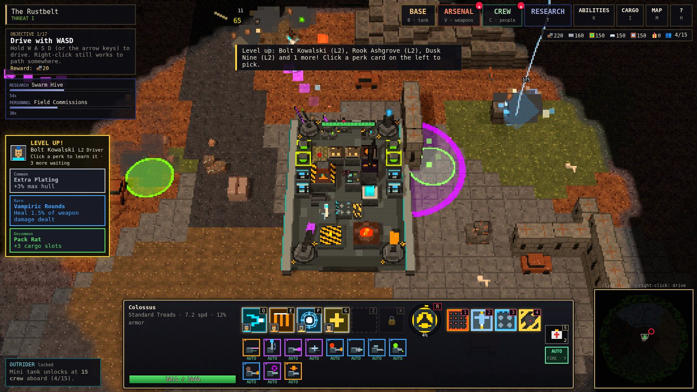

| | |
|---|---|
| 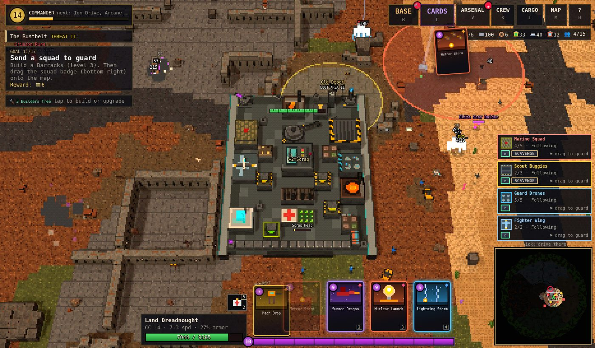 | 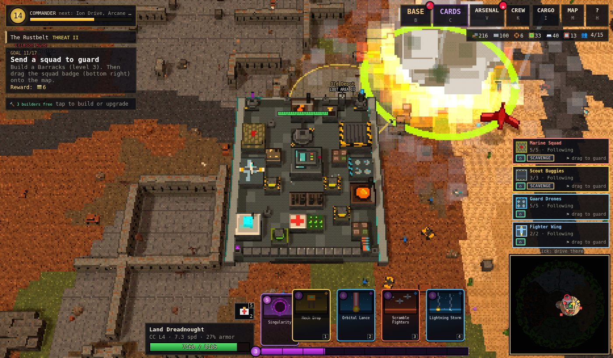 |
| 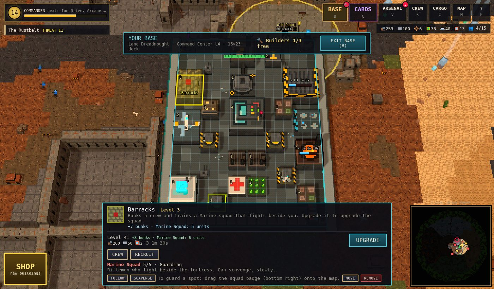 | 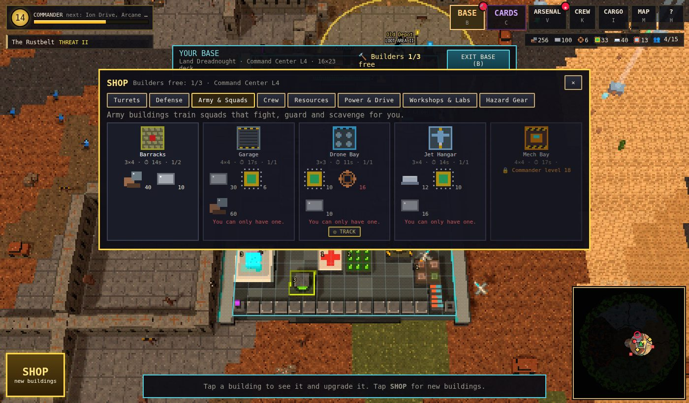 |
| 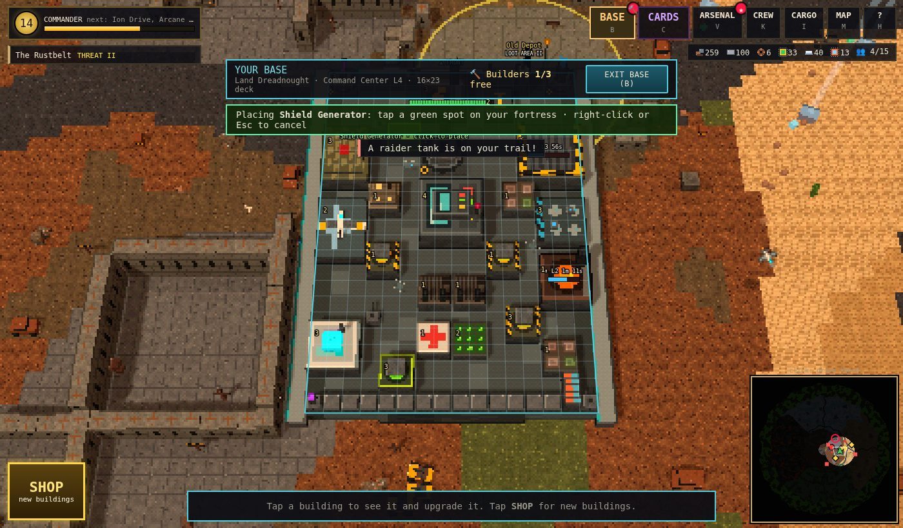 | 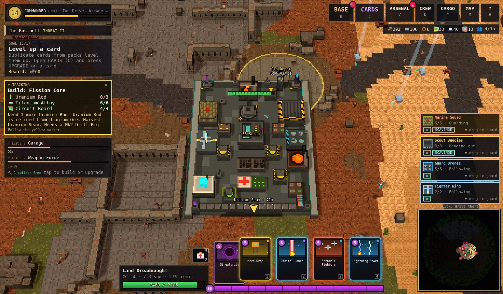 |
| 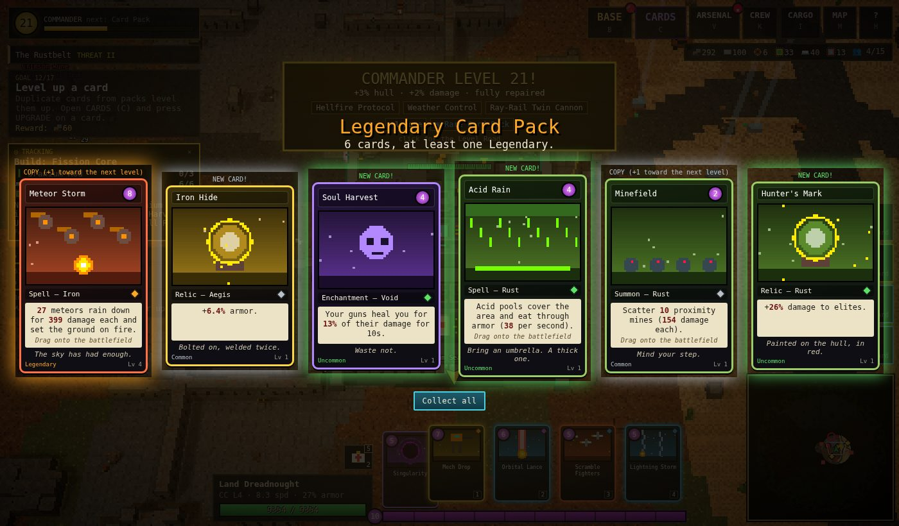 | 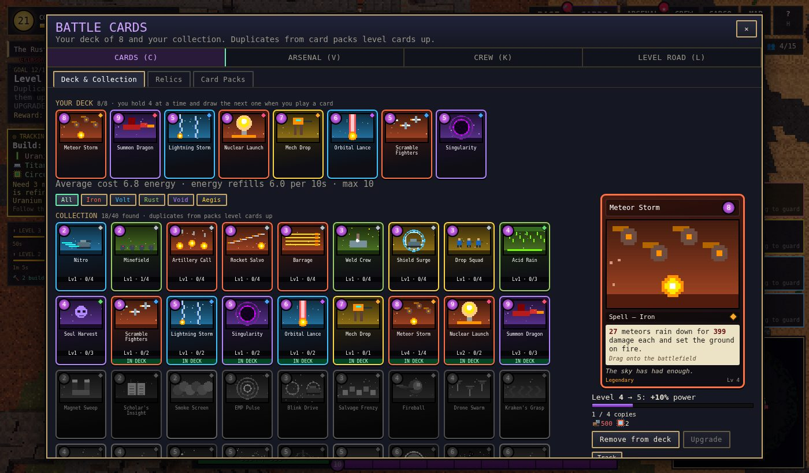 |
| 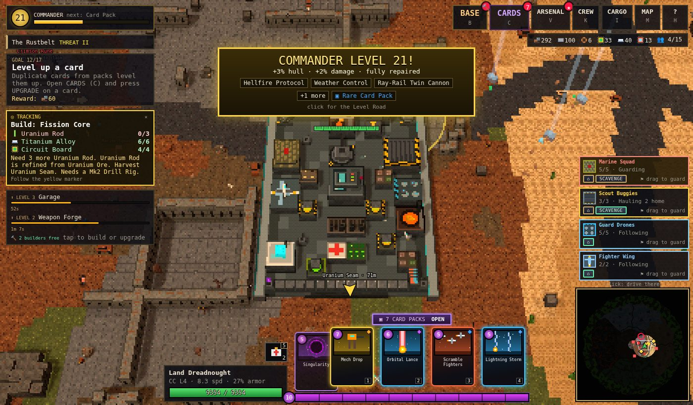 | 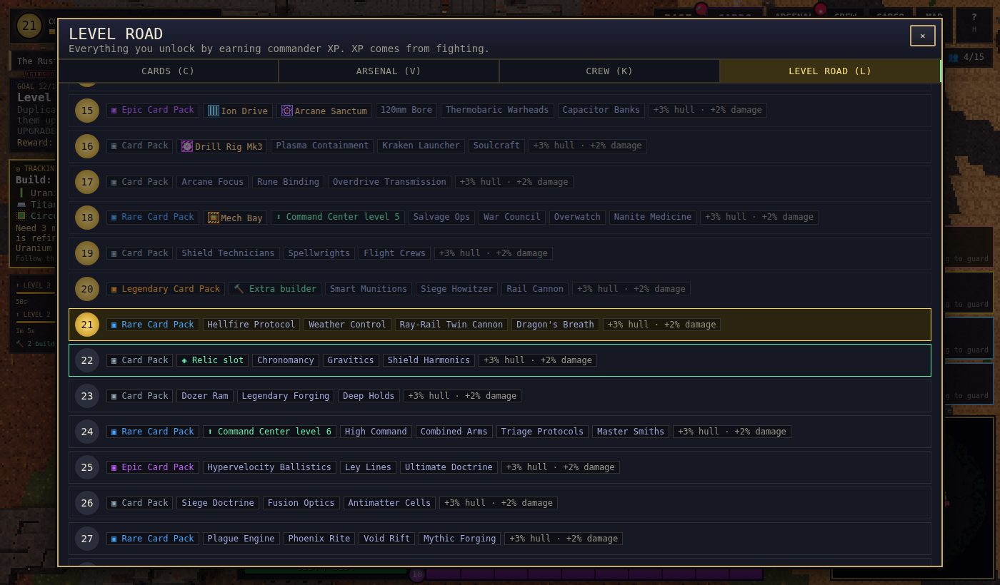 |
| 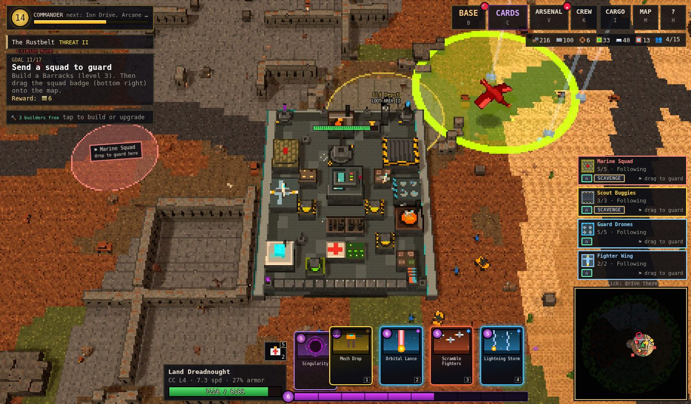 | 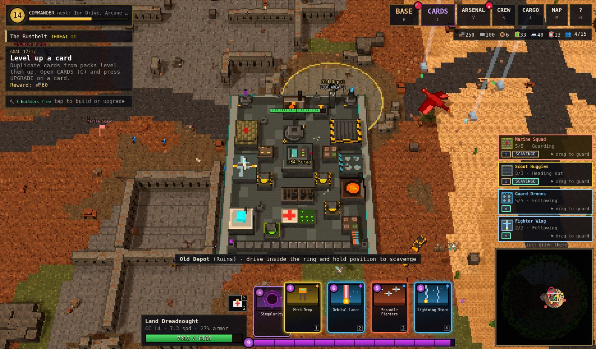 |
| 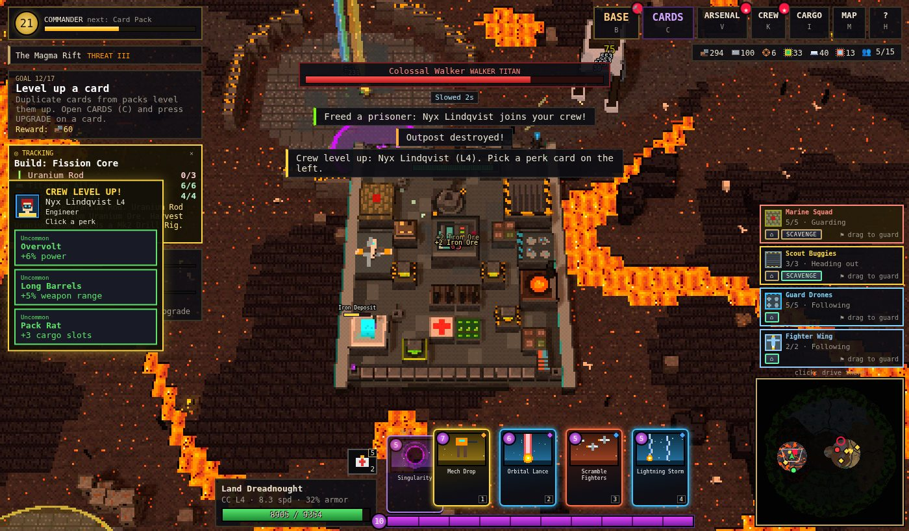 | 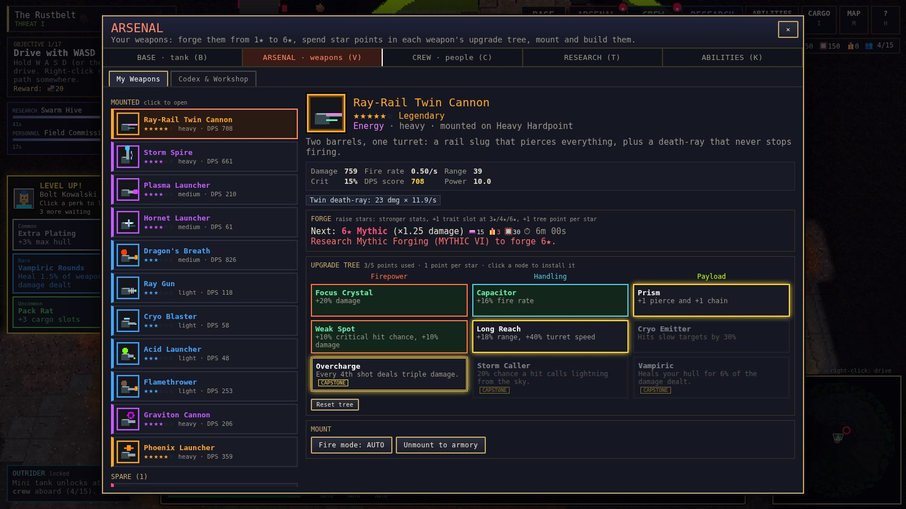 |

## Quick start

```bash
npm install
npm run dev          # client (Vite, http://localhost:5173) + Dead Zone server (ws on :8787)
```

Open http://localhost:5173 and press **Start**. Single-player only needs the browser. If the Dead Zone can't reach a server (for example when the game is embedded as a single file), you still get an **offline raid against bots**, run in the browser with the same server code.

| Command | What it does |
|---|---|
| `npm run build` | Typecheck and build the client into `dist/` |
| `npm start` | One process for production: serves `dist/` **and** the Dead Zone on `PORT` (default 8787) |
| `npm test` | Unit tests (world gen, pathing, the base and builders, cards, the Level Road, squads, tracking, crew, chests, saves, arsenal, Dead Zone server rules) |
| `npm run typecheck` | `tsc --noEmit` |

Server environment variables: `PORT`, `WARZONE_SEED` (fixed arena), `WARZONE_BOTS` (AI raiders, default 5).

## Controls

Everything works with the mouse. The camera always follows your fortress.

| Input | Action |
|---|---|
| **W A S D** / arrows | Drive. Screen-relative by default; switch to tank-style (W/S throttle, A/D turn) in the menu. |
| **Drag a card** onto the battlefield | Play it there. Or tap a card (or press **1-4**), then tap the ground. Self cards play on a tap. |
| **Right-click** | Drive there. On an enemy: focus fire. On a resource node: drill it. On a rune, loot area or the gate: go and use it. |
| **Drag a squad badge** onto the map | That squad guards the spot. ⌂ calls it back; SCAVENGE sends marines or buggies out. |
| **B**, or click your fortress | Your base (the village view). WASD drives off and leaves it. |
| **C** / **V** / **K** / **L** | Cards · Arsenal · Crew · Level Road |
| **I** / **M** / **H** / **Esc** | Cargo, Refinery & Workshop · World map · Help · Menu |
| **5** | Repair kit |
| **Wheel** | Zoom |
| **J** | Send the Outrider to the node or loot area under the cursor |

Menu buttons only appear once their feature unlocks, so there's never much to learn at once.

### On a phone or tablet

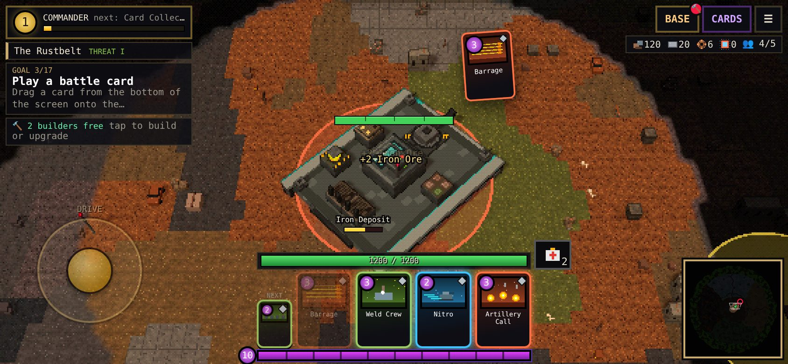

The first touch switches the game to touch controls (phones and tablets start in them). Sideways is best, but portrait works too. On small screens the HUD compacts: smaller cards, a hull bar above the hand, and full-screen panels.

| Touch | Action |
|---|---|
| **Stick** (bottom left) | Drive. Press anywhere in that corner and the stick centres under your thumb. How far you push it sets the speed. |
| **Tap** the battlefield | What right-click does: drive there, focus fire on an enemy, drill a node, use a rune, loot area or the gate. |
| **Hold a finger** on the ground | Keep steering toward it. |
| **Drag a card** out of the hand | Play it where you let go. Or tap the card, then tap the ground (tap the card again to cancel). |
| **Pinch** | Zoom |
| **Tap your fortress** or **BASE** | The base view. Tap a building to see it. To place one, tap a spot to preview it, then tap **PLACE** (or the same spot again). |
| **☰** | The menu: Cargo, Map, Level Road, Help, fullscreen, sound. |
| **Drag a squad badge** | Guard that spot. |

## How it plays

### Fight

- Your turrets pick their own targets. Drive toward trouble, or away from it.
- **Energy** (the purple bar) refills over time, 10 max. Every card has a cost. Play a card and the next one in your deck slides in, and the played card goes to the back.
- Area cards land where you drop them (up to 70 units from the fortress). Self cards (repairs, shields, speed, buffs) affect your fortress.

| School | Style | Examples |
|---|---|---|
| **Iron** | Explosions and fire | Artillery Call, Rocket Salvo, Fireball, Carpet Bomb, Meteor Storm, **Nuclear Launch** |
| **Volt** | Lightning, orbit and time | EMP, Lightning Storm, Orbital Lance, steerable **Orbital Laser**, **Time Stop**, Blink Drive, Cataclysm |
| **Rust** | Repair, acid and salvage | Weld Crew, Nanite Cloud, Acid Rain, Magnet Sweep, Salvage Frenzy, Minefield, Kraken's Grasp |
| **Void** | Gravity, drain and monsters | Singularity, Soul Harvest, Void Rift, Deadeye Salvo, **Summon Dragon** |
| **Aegis** | Shields and troops | Shield Surge, Aegis Dome, Drop Squad, Iron Legion, **Mech Drop**, Miracle Protocol, Juggernaut Charge |

**Relics** are permanent cards you slot for always-on bonuses (faster energy, lifesteal, a lethal-hit save, +2 max energy, every card costs 1 less...). You get relic slots at commander levels 6, 14 and 22.

### Level up (commander XP)

- XP comes from **killing enemies** (tougher enemies give more), clearing **loot areas**, destroying **outposts** and **raider tanks**, claiming **runes** and felling **titans**.
- Every level: **+3% hull, +2% weapon damage**, a full repair and a card pack (Rare every 3 levels, Epic every 5, Legendary every 10).
- The **Level Road** (`L`) shows what each of the 30 levels unlocks: buildings, weapon families and upgrades, crew upgrades, extra builders (levels 10 and 20), relic slots, and features (Crew, Squads, Arsenal, Relics, the Dead Zone, the Outrider).

### Build (the base, `B`)

- The camera swings in and turns so the front of your fortress points up. **Tap a building** to see it and upgrade it, move it or remove it, or jump to what it does (mount a weapon, refine ore, craft, forge, hire crew, command its squad, change the drive train).
- **SHOP:** every building by category, with its footprint, build time, cost and how many you have of the Command Center's limit. Pick one, then tap a green spot on the deck.
- **Builders:** 2 at the start (3 at level 10, 4 at level 20). Each works on one job at a time, in real time, while you drive and fight. Buildings keep working while they're being upgraded.
- **Command Center:** its level (1-6) sets the fortress size and the cap on everything else. Upgrading it needs commander levels 3, 7, 12, 18 and 24.

  | Command Center | Fortress | Deck |
  |---|---|---|
  | 1 | Crawler Facility | 10×14 |
  | 2 | Assault Facility | 12×17 |
  | 3 | Siege Citadel | 14×20 |
  | 4 | Land Dreadnought | 16×23 |
  | 5 | Colossus | 18×27 |
  | 6 | Moving Citadel | 20×31 |

- **Buildings:**

  | Group | Buildings |
  |---|---|
  | Turrets | Light, medium and heavy turret mounts (each level +15% damage) |
  | Defense | Armor Plate, Heavy Armor Plate, Repair Bay, Shield Generator, Radar Mast |
  | Army & squads | Barracks (marines), Garage (scout buggies, the Outrider), Drone Bay, Jet Hangar, Mech Bay |
  | Crew | Living Quarters, Medbay, Hydroponics, Mess Hall, Training Grounds |
  | Resources | Cargo Hold, Refinery, Mk2/Mk3 drill rigs, Secure Vault |
  | Power & drive | Scrap Reactor, Fission Core, Diesel Engine, Ion Drive |
  | Workshops & labs | Workshop, **Card Lab** (card power and energy regen), Weapon Forge, Ammo Depot, Arcane Sanctum |
  | Hazard gear | Rad Baffles, Thermal Regulator, Sealant Pumps |

### Squads

| Squad | Building | Good at |
|---|---|---|
| Marine Squad | Barracks | Fighting beside you; can scavenge slowly |
| Scout Buggies | Garage | Scavenging ahead and hauling loot home |
| Guard Drones | Drone Bay | Guarding a spot |
| Fighter Wing | Jet Hangar | Strafing and bombing; can't be shot down |
| Walker Mech | Mech Bay | Soaking damage, cannon and missiles |

The building's level sets the squad's size and strength. Fallen units are replaced over time.

### Loot

- **Weapons** go from **1★ to 6★ Mythic**. Mount them on turret mounts in the **Arsenal** (`V`). Each star is a point in that weapon's own upgrade tree, and a **Weapon Forge** adds stars over time. There are 35 weapons: ray guns, acid and plasma launchers, a Ray-Rail twin cannon, a turret that launches mini fighter jets, storm spires, gravity cannons, the Void Lance.
- **Park on a resource node** and your fortress drills it by itself. Refine ore at a **Refinery** (CARGO > Refine & Craft).
- **Loot areas** (yellow ◆): park inside the ring and hold while defenders attack.
- **Runes** (colored ●): beat the guardians, then park beside the altar for a 90 s buff, a **Rune Chest** (exclusive weapons, exclusive characters, champions) and a card pack.
- **Crew** give passive bonuses, pick perk cards as they level, and each brings their signature card. Max 15 aboard; at 15 you can launch the **Outrider** mini tank.

### The wasteland

The world is 640×640 tiles in six zones. Danger rises with distance from camp, in tiers I–V:

| Zone | Direction | What you need |
|---|---|---|
| **Rustbelt** | Center | Home turf |
| **Dune Sea** | East | Dune tracks, or you crawl |
| **Cryo Spires** | North | Spiked chains and a Thermal Regulator |
| **Glass Crater** | South | Rad Baffles |
| **Magma Rift** | West | A Thermal Regulator, plus magma treads to cross lava |
| **Acid Marsh** | Outer ring | Hover skirts and Sealant Pumps |

### The Dead Zone (multiplayer, commander level 8)

Drive into the gate north-east of camp. Loot crates and supply drops, fight other commanders and AI raiders, and hold position at a green **extraction** beacon for 6 seconds to keep what you found. Your cards come with you. If your fortress is destroyed there, you drop your cargo hold (except Vault slots), every spare weapon and one mounted weapon as a wreck anyone can loot. The server owns health, damage, deaths, crates and extraction, and caps reported hits and damage per second.

## Tech

- **TypeScript + Vite**, **three.js** for rendering, **ws** for the server, **Vitest** for tests. No image or audio files: every texture, sprite, portrait, card illustration, icon and sound is generated at startup.
- **8-bit look:** the scene renders at 1/2–1/4 resolution into a render target (on phones, about 300 lines on the short side, each game pixel a whole number of device pixels). A post pass draws 1-pixel depth outlines and posterizes with ordered dithering, and the result is upscaled with nearest-neighbour filtering.
- **Simulation:** fixed 60 Hz steps.
  - Your fortress is one world unit per deck cell (enemy rigs are smaller). It paths with A* over a "crush" clearance field where only cliffs, pillars and liquids block, and it flattens obstacles and props under its hull. The terrain chunks it touches are rebuilt in the same frame.
  - Squads and summons are `Ally` entities with anchors: follow the fortress, guard a point, or scavenge a target.
- **Save:** localStorage (`ironcrawl3d-save-v1`, format v5), autosaved every 30 s. Older saves move into the bigger fortress automatically.

```
src/shared/   map (with crush nav), world + arena generation, collision & A*, items, weapons, rarity, loot, protocol, Dead Zone server sim
src/game/     Game state, tank, cards, progress (Level Road), squads, crew, arsenal (forge), chests, actions, save, and systems/
              (movement + crushing, weapons, projectiles, cards, squads, builds, tracking, allies, AI, world, crew, outrider, spawns)
src/render/   three.js view (camera follow, base view, aim ring, beacon), pixel post pass, terrain chunks, voxel models, sprites, particles,
              fog of war, overlay (bars, base grid, tracking arrow), minimap, icons and card art
src/ui/       HUD (commander, hand, energy, squads, tracker, touch stick), base view, CARDS / LEVEL ROAD / ARSENAL / CREW / CARGO / MAP panels, chests, title
src/net/      Dead Zone client (WebSocket with an in-browser fallback)
server/       Node host for the Dead Zone (serves dist/ too)
legacy/2d/    the original side-view 2D prototype, kept for reference
```

See [docs/DESIGN.md](docs/DESIGN.md) for the design notes.
