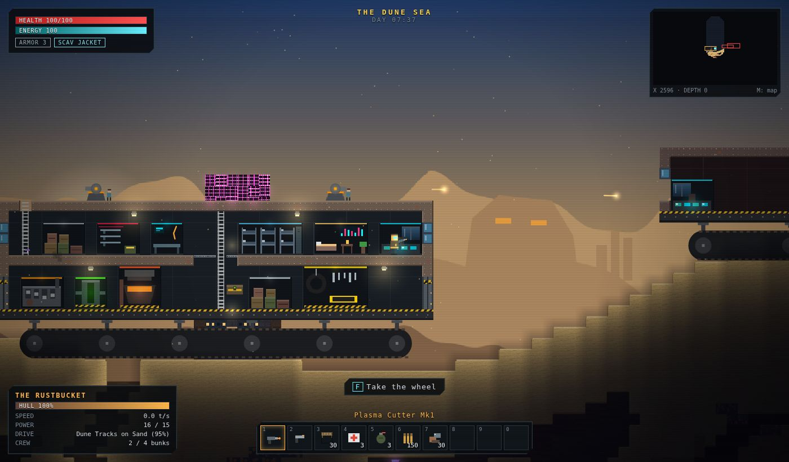
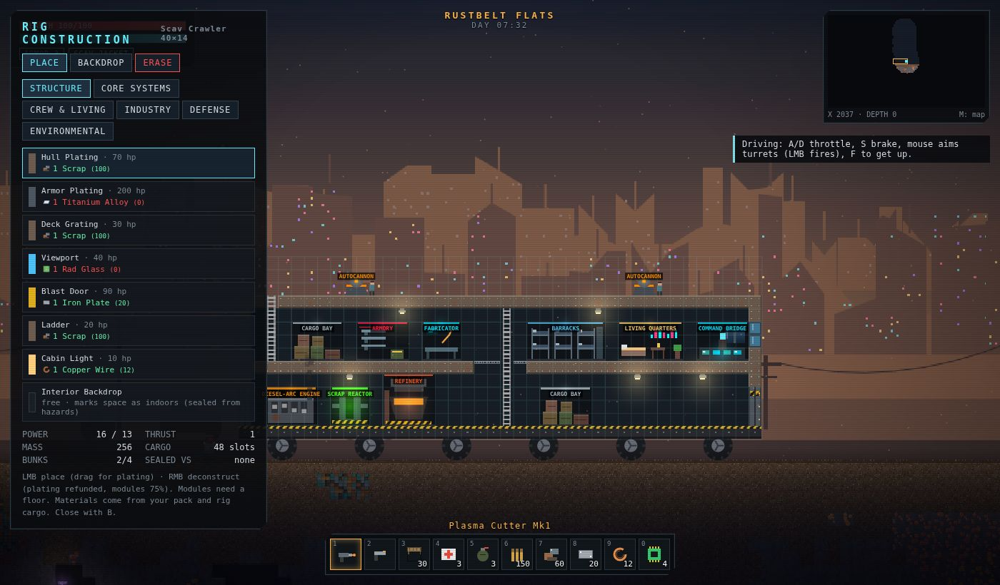

# IRONCRAWL

A 2D open-world sandbox in the spirit of Terraria, set in a tech-punk wasteland. Your base is a **huge rolling fortress** that you fortify, crew and upgrade facility by facility while driving it across six hostile zones. Raider war-rigs hunt you out in the open world. Past the checkpoint lies **the Dead Zone**, a multiplayer warzone where anything you carry can be taken from your corpse.


| | |
|---|---|
|  |  |
|  |  |

## Quick start

```bash
npm install
npm run dev          # client (Vite, http://localhost:5173) + Dead Zone server (ws on :8787)
```

Open http://localhost:5173 and pick **NEW RUN**. Single-player needs only the browser. The Dead Zone needs the server, which `npm run dev` starts for you.

Other scripts:

| Command | What it does |
|---|---|
| `npm run build` | Typecheck and build the client into `dist/` |
| `npm start` | One process for production: serves `dist/` **and** the Dead Zone on `PORT` (default 8787) |
| `npm test` | Unit tests (inventory, worldgen, physics, rig driving, warzone server rules) |
| `npm run typecheck` | `tsc --noEmit` |

Server environment variables: `PORT`, `WARZONE_SEED` (fixed map), `WARZONE_BOTS` (AI scavengers, default 5).

## Controls

| Key | Action |
|---|---|
| `A` `D` | Move · (driving) throttle |
| `Space` / `W` | Jump. Hold in the air with a jetpack equipped |
| `W` `S` | Climb ladders · `S` drops through platforms · (driving) brake |
| LMB | Use held item: mine, shoot, place a block, eat · (driving) fire turrets at the cursor |
| RMB | With a Plasma Cutter: repair your rig (costs scrap) |
| `1`–`0`, wheel | Hotbar |
| `F` | Interact: take the wheel, open caches, use stations, enter the Dead Zone, search crates |
| `I` / `Tab` | Inventory (shift-click moves items between pack and rig cargo) |
| `C` | Crafting |
| `B` | Build mode: rig construction |
| `R` | Rig management: drive trains, chassis upgrades, crew, emergency winch |
| `M` | Map · `-` `=` zoom · `N` sound · `H` help · `Esc` pause |

## How it plays

### The rig

You start with **The Rustbucket**, a 40×14-tile two-deck crawler. It's a real tile grid that moves through the world. You walk around inside it, it carries you as it drives, and you build on it in Build mode:

- **Structure:** hull and armor plating, deck grating, ladders, viewports, blast doors (they open for you and stop boarders), cabin lights, and interior backdrop. Backdrop marks a space as sealed and indoors, which is what protects you from hazards.
- **25 facility modules** in five groups:
  - **Core:** Command Bridge, Scrap Reactor, Fission Core, Diesel-Arc Engine, Ion Drive.
  - **Crew & living:** Barracks, Living Quarters (your respawn point), Medbay, Hydroponics.
  - **Industry:** Cargo Bay, Fabricator, Refinery, Armory, Drive Workshop, Repair Drones, Drill Ram.
  - **Defense:** Autocannon, Flak Battery, Laser Turret, Missile Pod, Shield Generator, Radar Mast.
  - **Environmental:** Rad Baffles, Thermal Regulator, Hull Sealant Pump.
- **Power** is a budget: reactors produce it, everything else draws it. In a deficit, everything slows down.
- **Speed** comes from thrust versus mass. A bigger base needs more engines.
- **Crew** live in barracks bunks. They man turrets (an uncrewed turret stays silent) and shoot boarders.
- **Chassis upgrades** grow the grid: Scav Crawler 40×14, then Road Hauler 56×18, Behemoth 76×22 and Leviathan 100×28. That leaves room for barracks, living quarters, an armory and all the loot you haul.

### Zones, drive trains and equipment

The world is 4,800 × 400 tiles, split into six zones from west to east. Each zone blocks you with a **terrain type** that needs the right drive train, plus a **hazard** that needs a rig module (and a suit when you're on foot):

| Zone | Terrain | Needs to drive | Hazard | Protection | Signature loot |
|---|---|---|---|---|---|
| Magma Rift | ash crust, lava chasms | Magma Treads | Heat | Thermal Regulator / Thermal Suit | sulfur, deep xenite |
| Cryo Spires | ice & snow peaks | Spiked Chains | Cold | Thermal Regulator / Thermal Suit | cryo crystal |
| **Rustbelt Flats** (start) | hardpan | anything | none | none | scrap, iron, copper |
| The Dune Sea | sand dunes | Dune Tracks | none | none | titanium |
| Glass Crater | fused glass bowl | anything | Radiation | Rad Baffles / Rad Suit | uranium |
| Acid Marsh | mud & acid pools | Hover Skirts | Toxic | Hull Sealant Pump / Hazmat Suit | xenite |

On the wrong drive train your rig bogs down, slips on slopes, cooks its wheels or wades through acid. The HUD tells you why. If you get stuck, the Rig panel can winch you back to the last safe ground. The progression is a web: dune titanium unlocks chains and rad baffles, crater uranium and cryo crystals unlock hover skirts, and marsh xenite unlocks endgame gear.

### Other bases

- **Raider war-rigs** roam each zone and are built from the same grid system as yours, tougher in harder zones. They close to cannon range, deploy boarding troopers from their barracks, and their troopers batter your doors. Destroy the Command Bridge to wreck them, then cut the wreck apart with your Plasma Cutter for salvage.
- **Raider outposts** are fortified, stationary bases with turrets and garrisons (one or two per zone). Wreck one and it stays cleared.
- **Creatures and drones** vary by zone. More come out at night.

### The Dead Zone (multiplayer)

Drive to the checkpoint east of spawn, stand under the gate and press `F`.

- **At risk:** everything in your **pack and hotbar**. When you die it drops into a crate that any raider can loot. Disconnecting mid-raid counts as dying.
- **Safe:** your 3-slot **secure pouch**, your equipped **suit** and your equipped **gadget**.
- Stand in an **extraction zone** (West Gate, East Gate, Metro Exfil) for 6 seconds to go home with everything you're carrying.
- **Supply drops** land every 90 seconds with high-tier loot (xenite, uranium rods, rail lances, Warborn Exo armor).
- **AI scavengers** roam the map so a solo raid still has something to fight. They carry loot and drop it when killed.

The server owns health, deaths, crates, supply drops and extraction checks. Clients own their own movement and report the hits they land. The server sanity-checks each hit: damage is capped per weapon, distance is checked, and damage per second is rate-limited.

## Architecture

```
src/shared/     Pure simulation code, shared by the browser and the server
  tiles.ts        tile + background-wall definitions (terrain type, hardness, light, hazards)
  zones.ts        the six zones (+ the Dead Zone): palettes, hazards, requirements
  items.ts        59 items: resources, weapons, tools, suits, gadgets, drive trains
  worldgen.ts     seeded open-world generator (heightmaps, caves, ores, ruins, bunkers, outposts)
  warzoneGen.ts   the Dead Zone city map (towers, metro, extraction points)
  physics.ts      AABB-vs-tile-grid collision that works on the world *and* on moving rigs
  protocol.ts     Dead Zone wire format
src/game/       Client game logic
  rig.ts          the mobile base: tile grid, modules, power/mass/thrust, terrain-aware driving, drilling, damage
  rigDefs.ts      rig tiles, facility modules, drive trains, chassis tiers
  rigTemplates.ts starter rig, raider war-rigs, outposts
  systems/        player, combat, enemies, rigs (turrets/crew/raider AI), hazards, build mode, drops
  warzone.ts      Dead Zone client
src/render/     Canvas renderer: procedural pixel-art tiles, chunk cache, parallax, tile lighting, rig art
src/ui/         DOM HUD and panels
server/         Node WebSocket server for the Dead Zone (+ static hosting of dist/)
tests/          Vitest suites
```

All art and sound are procedural (canvas drawing and WebAudio synthesis), so there are no asset files. Saves go to `localStorage`: the world seed plus your changes to it, and your rig, inventory and explored map.

See [docs/DESIGN.md](docs/DESIGN.md) for the design notes and roadmap.
