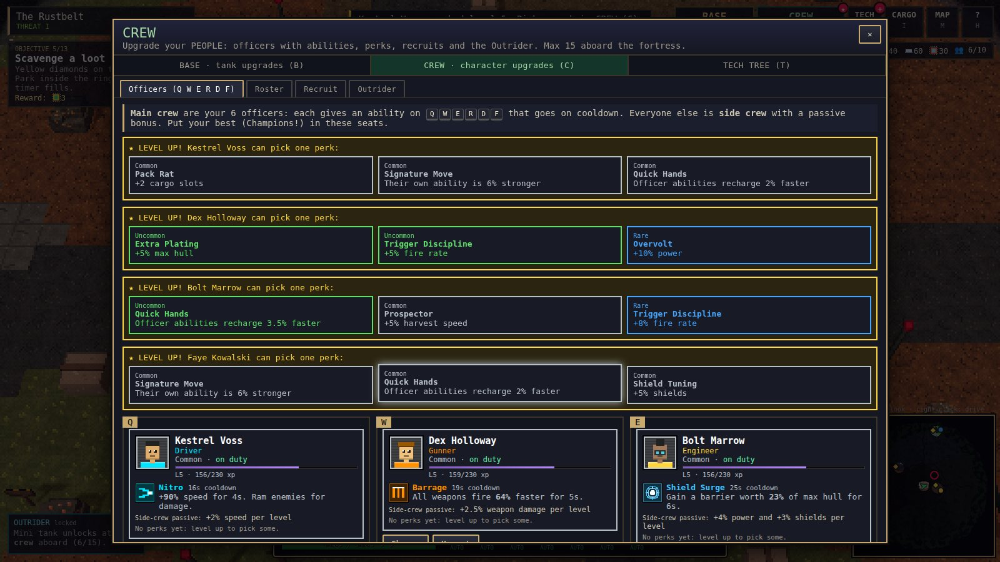

# IRONCRAWL

An overhead 3D, pixel-art wasteland game about commanding a **giant rolling tank-fortress**. It plays like a MOBA: right-click to drive, your guns aim and fire on their own, and your officers' abilities sit on **Q W E R D F** with cooldowns. The art is chunky 8-bit in the spirit of Terraria.

The base is the tank. You fill its deck with barracks, living quarters, reactors, cargo holds and weapon hardpoints, and grow it from a Light Crawler into a Colossus. The crew who live aboard level up and pick perks. Near camp you meet scrap rats and scavengers. Deeper into the wasteland you meet raider tanks, enemy outposts, elites and **titans**. North-east of camp is **the Dead Zone**, a multiplayer warzone where other players can loot your wreck.


| | |
|---|---|
|  |  |
|  |  |
|  |  |
|  |  |

## Quick start

```bash
npm install
npm run dev          # client (Vite, http://localhost:5173) + Dead Zone server (ws on :8787)
```

Open http://localhost:5173 and press **Start**. Single-player only needs the browser. If the Dead Zone can't reach a server (for example when the game is embedded as a single file), you still get an **offline raid against bots**, run in the browser with the same server code.

| Command | What it does |
|---|---|
| `npm run build` | Typecheck and build the client into `dist/` |
| `npm start` | One process for production: serves `dist/` **and** the Dead Zone on `PORT` (default 8787) |
| `npm test` | Unit tests (world gen, pathing, fortress, crew, chests, saves, Dead Zone server rules) |
| `npm run typecheck` | `tsc --noEmit` |

Server environment variables: `PORT`, `WARZONE_SEED` (fixed arena), `WARZONE_BOTS` (AI raiders, default 5).

## Controls

| Input | Action |
|---|---|
| **Right-click** | Drive there. On an enemy: focus fire. On a resource node: harvest it. On a rune, loot area or the gate: go and use it. Hold to keep steering. |
| **Q W E R D F** | Officer abilities (each has a cooldown). Aimed abilities fire at the cursor. |
| **Left mouse** | Fire every weapon set to **MANUAL** at the cursor |
| **Z** | Auto-fire on/off for every weapon. Click a weapon icon to switch just that one. |
| **S** | Stop |
| **1** | Repair kit |
| **Y** / **Space** | Lock the camera / hold to recenter. The screen edge or arrow keys pan when unlocked. |
| **Wheel** | Zoom |
| **G** | Send the Outrider to the resource node or loot area under the cursor |
| **B** / **C** / **T** | BASE (tank upgrades) · CREW (character upgrades) · Tech Tree |
| **I** / **M** / **H** / **Esc** | Cargo & Workshop · World map · Help · Menu |

## How it plays

### Upgrade your BASE (`B`): things bolted to the tank

- **Deck & Build.** The deck is a grid (7×10 cells on the Light Crawler, 13×21 on the Colossus). Place facilities on it:
  - Command Bridge, reactors and a fission core, diesel and ion engines.
  - Living Quarters and Barracks, which set how many crew you can bunk. Medbay and Hydroponics.
  - Cargo Holds, a Secure Vault, Refinery, Workshop, Mk2/Mk3 drill rigs and a Garage.
  - Armor plating, a shield generator, a repair bay and a radar mast.
  - Hazard gear: Rad Baffles, Thermal Regulator, Sealant Pumps.
  - Light, medium and heavy **hardpoints**.
- **Armory.** Mount weapons on hardpoints of the right size: autocannon, gatling, flak, laser, point defense, missile pod, mortar, tesla coil, 88 mm main battery and rail cannon. You can build Common copies. Better ones drop as loot.
- **Chassis & Drive.** Five hulls from Light Crawler to Colossus. Five drive trains: standard treads, dune tracks, spiked chains, magma treads and hover skirts. Each zone needs different gear, and the panel shows what you're missing.
- **Tech Tree (`T`).** 34 nodes in 7 branches: ballistics, artillery, missiles, energy, defense, hull and industry. They unlock equipment or upgrade a whole weapon family. Research costs **Salvaged Tech**, which drops from raider tanks, outposts, elites, titans and chests.

### Upgrade your CREW (`C`): your people

- **Officers (main crew).** Six seats bound to **Q W E R D F**. Each officer brings their role's **active ability** with a cooldown:

  | Role | Ability |
  |---|---|
  | Gunner | Barrage |
  | Engineer | Shield Surge |
  | Mechanic | Weld Crew |
  | Medic | Triage |
  | Driver | Nitro |
  | Scavenger | Magnet Sweep |
  | Quartermaster | Artillery Call |
  | Scientist | EMP Pulse |
  | Marine | Drop Squad |

- **Side crew.** Everyone else gives a passive bonus by role.
- **Levels and perks.** On every level-up, pick **1 of 3 perks**. Perks roll a **rarity** (Common → Legendary), and rarer perks are stronger.
- **Champions** (Legendary) have signature abilities that outclass the basics, like Juggernaut Charge, Orbital Lance or Singularity. **Exclusive characters** (Epic) have unique passives. Both come only from **Rune Chests**.
- **Max 15 aboard.** Once the fortress holds 15 crew you can launch the **Outrider** from a Garage. It's a mini tank crewed by side crew. It follows you and fights, and you can send it on **expeditions** to harvest nodes or scavenge loot areas by itself. If it's destroyed, each crew member aboard may die (medics improve the odds).

### Loot, rarities and chests

- Weapons and perks come in **Common, Uncommon, Rare, Epic and Legendary**. Rarer weapons hit harder, fire faster and roll bonus traits: Heavy, Rapid, Long-barrel, Incendiary, Piercing, High-yield, Arcing, Keen, Leeching.
- **Loot areas** (yellow ◆): park inside the ring and hold while defenders attack. They pay out materials, often a weapon, and sometimes a **This-or-That chest**. You pick one of its two rewards and the other is gone.
- **Runes** (colored ●): jungle-camp style. Beat the guardians, then park beside the altar. You get a 90 s buff (Crimson, Azure, Verdant or Gilded) and a **Rune Chest**, which can hold an **exclusive weapon** or an exclusive character. Rarely, it holds a **champion**.
- **Exclusive weapons** are always Legendary: Sunspear Lance, Hydra Rack, Thunderhead Coil, Grinder Maw and Oblivion Mortar.

### The wasteland

The world is 640×640 tiles in six zones. Danger rises with distance from camp, in tiers I–V:

| Zone | Direction | What you need |
|---|---|---|
| **Rustbelt** | Center | Home turf |
| **Dune Sea** | East | Dune tracks, or you crawl |
| **Cryo Spires** | North | Spiked chains and a Thermal Regulator |
| **Glass Crater** | South | Rad Baffles |
| **Magma Rift** | West | A Thermal Regulator, plus magma treads to cross lava |
| **Acid Marsh** | Outer ring | Hover skirts and Sealant Pumps |

Roads and lava bridges link the zones. You explore under a **fog of war**. Things you'll run into:

- **Raider tanks:** enemy bases on treads, armed with rarity-rolled weapons.
- **Outposts:** fortresses that drop a This-or-That chest and free a prisoner.
- **Titans**, each attack telegraphed on the ground:
  - The **Colossal Walker** stomps and lobs boulders.
  - The **Dread Behemoth** charges.
  - The **Burrow Titan** erupts from below.

### The Dead Zone (multiplayer)

Drive into the gate north-east of camp:

- Loot crates and the supply drops that land in the plaza.
- Fight other commanders and AI raiders.
- To keep what you found, hold position at a green **extraction** beacon for 6 seconds.

If your fortress is destroyed there, you drop your cargo hold (except Vault slots), every spare weapon and one mounted weapon. The drop becomes a wreck that anyone can loot. Leaving mid-raid counts as dying.

The server owns health, damage, deaths, crates and extraction. It caps each reported hit by the weapon's maximum and each attacker's damage per second, and it rejects teleports.

## Tech

- **TypeScript + Vite**, **three.js** for rendering, **ws** for the server, **Vitest** for tests. No image or audio files: every texture, sprite, portrait, icon and sound is generated at startup.
- **8-bit look:** the scene renders at 1/2–1/4 resolution into a render target. A post pass then draws 1-pixel depth outlines and posterizes with ordered dithering, and the result is upscaled with nearest-neighbour filtering.
  - Terrain is voxel chunks built from a procedural 16×16 texture atlas.
  - Tanks are voxel models generated from the deck layout: turrets rotate and treads scroll.
  - Creatures are pixel billboards.
  - Fog of war is a data texture sampled by every world material.
- **Simulation:** fixed 60 Hz steps. Tanks are capsules pathing with A* over a clearance field, so big hulls only take routes they fit through. Weapons are projectiles, hitscan beams, chain lightning, homing missiles or lobbed artillery.
- **Save:** localStorage (`ironcrawl3d-save-v1`), autosaved every 30 s.

```
src/shared/   map, world + arena generation, collision & A*, items, weapons, rarity, loot, protocol, Dead Zone server sim
src/game/     Game state, tank, crew, tech, chests, actions, save, and systems/ (movement, weapons, projectiles, AI, world, crew, outrider, spawns)
src/render/   three.js view + pixel post pass, terrain chunks, voxel models, sprites, particles, fog of war, overlay, minimap, icons
src/ui/       HUD, BASE / CREW / TECH / CARGO / MAP panels, chests, title
src/net/      Dead Zone client (WebSocket with an in-browser fallback)
server/       Node host for the Dead Zone (serves dist/ too)
legacy/2d/    the original side-view 2D prototype, kept for reference
```

See [docs/DESIGN.md](docs/DESIGN.md) for the design notes.
