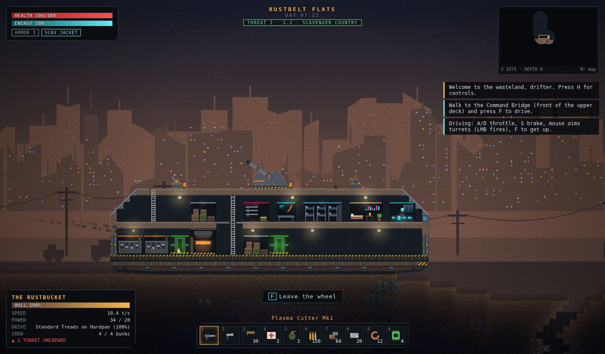
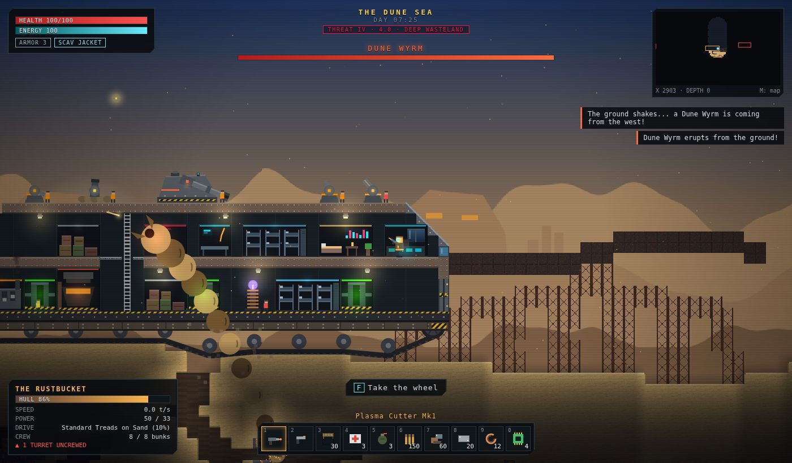
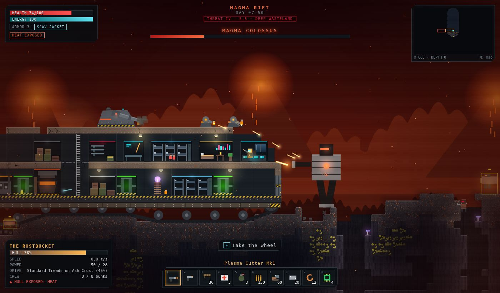
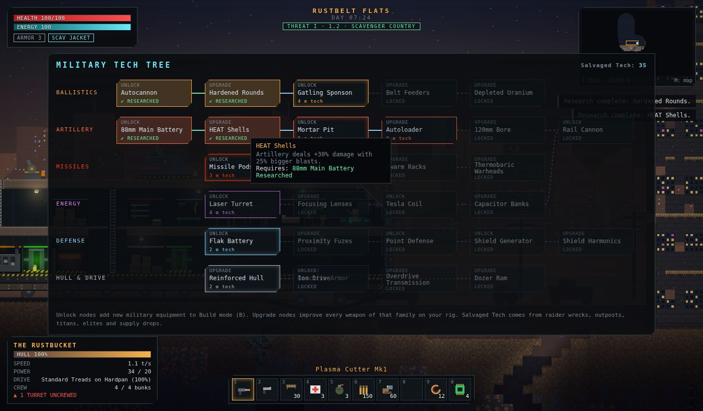
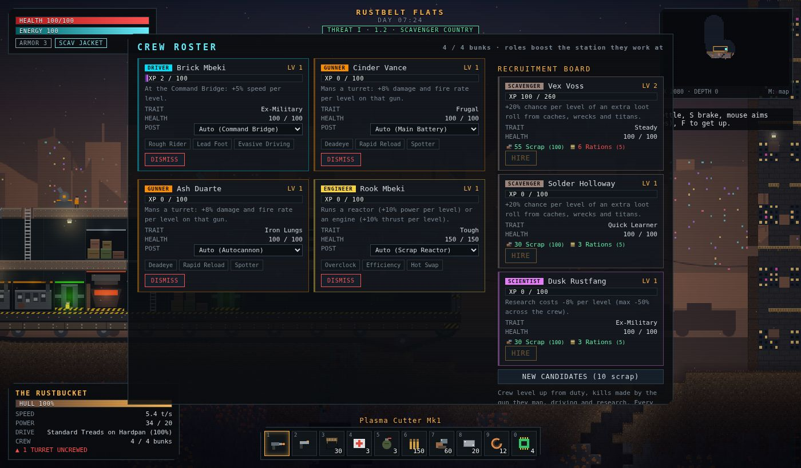
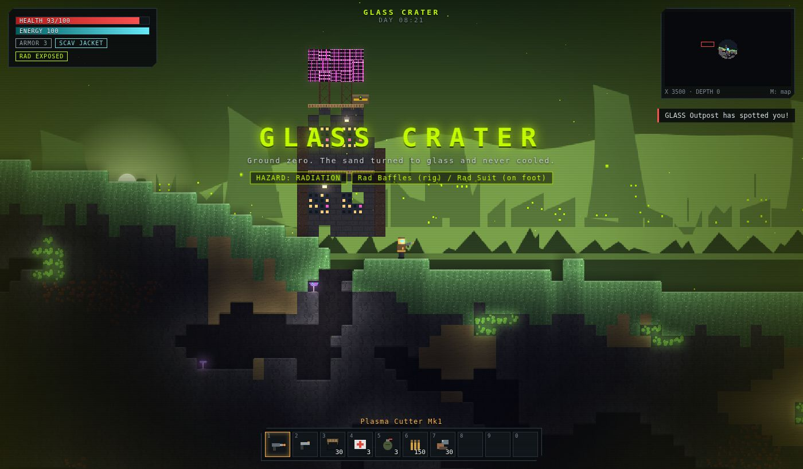

# IRONCRAWL

A 2D open-world sandbox in the spirit of Terraria, set in a tech-punk wasteland. Your base is a **huge land-tank**: a multi-deck armored hull on treads that you walk around inside and drive. You fortify it facility by facility, arm it with military hardware you upgrade through a tech tree, and crew it with specialists who level up and learn perks.

Near camp you meet scavengers and critters. The deeper into the wasteland you go, the tougher the enemies get: gunners, brutes, elite Alphas, and finally **titans** big enough to fight your tank. Past the checkpoint lies **the Dead Zone**, a multiplayer warzone where anything you carry can be taken from your corpse.



| | |
|---|---|
|  |  |
|  |  |
|  |  |

## Quick start

```bash
npm install
npm run dev          # client (Vite, http://localhost:5173) + Dead Zone server (ws on :8787)
```

Open http://localhost:5173 and pick **NEW RUN**. Single-player needs only the browser. The Dead Zone needs the server, which `npm run dev` starts for you.

Other scripts:

| Command | What it does |
|---|---|
| `npm run build` | Typecheck and build the client into `dist/` |
| `npm start` | One process for production: serves `dist/` **and** the Dead Zone on `PORT` (default 8787) |
| `npm test` | Unit tests (inventory, worldgen, physics, rig driving, warzone server rules) |
| `npm run typecheck` | `tsc --noEmit` |

Server environment variables: `PORT`, `WARZONE_SEED` (fixed map), `WARZONE_BOTS` (AI scavengers, default 5).

## Controls

| Key | Action |
|---|---|
| `A` `D` | Move · (driving) throttle |
| `Space` / `W` | Jump. Hold in the air with a jetpack equipped |
| `W` `S` | Climb ladders · `S` drops through platforms · (driving) brake |
| LMB | Use held item: mine, shoot, place a block, eat · (driving) fire turrets at the cursor |
| RMB | With a Plasma Cutter: repair your rig (costs scrap) |
| `1`–`0`, wheel | Hotbar |
| `F` | Interact: take the wheel, open caches, use stations, enter the Dead Zone, search crates |
| `I` / `Tab` | Inventory (shift-click moves items between pack and rig cargo) |
| `C` | Crafting |
| `B` | Build mode: rig construction |
| `R` | Rig management: drive trains, chassis upgrades, emergency winch |
| `P` | Crew roster: stations, perks, recruitment board |
| `T` | Military tech tree |
| `M` | Map · `-` `=` zoom · `N` sound · `H` help · `Esc` pause |

## How it plays

### The tank

You start with **The Rustbucket**, a 48×16-tile two-deck tank. It has sloped glacis armor at both ends, tread units with road wheels and armored side skirts, and an 88 mm **Main Battery** turret on the roof between two autocannons. It's a real tile grid that moves through the world. You walk around inside it, it carries you as it drives, and you build on it in Build mode:

- **Structure:** hull, armor and glacis plating, deck grating, ladders, viewports, blast doors (they open for you and stop boarders), cabin lights, and interior backdrop. Backdrop marks a space as sealed and indoors, which is what protects you from hazards and soaks blast damage.
- **31 facility modules** in five groups:
  - **Core:** Command Bridge, Scrap Reactor, Fission Core, Diesel-Arc Engine, Ion Drive.
  - **Crew & living:** Barracks, Living Quarters (your respawn point), Medbay, Hydroponics.
  - **Industry:** Cargo Bay, Fabricator, Refinery, Armory, Drive Workshop, Repair Drones, Drill Ram.
  - **Military:** Autocannon, Gatling Sponson, Main Battery, Mortar Pit, Rail Cannon, Missile Pod, Laser Turret, Tesla Coil, Flak Battery, Point Defense, Shield Generator, Radar Mast.
  - **Environmental:** Rad Baffles, Thermal Regulator, Hull Sealant Pump.
- **Power** is a budget: reactors produce it, everything else draws it. In a deficit, everything slows down.
- **Speed** comes from thrust versus mass. A heavier tank needs more engines.
- **Crushing:** anything small in front of the treads gets run over.
- **Chassis upgrades** grow the hull: Light Crawler 48×16, then Assault Landship 64×20, Siege Landship 84×24, Land Dreadnought 110×28 and Colossus 140×34.

### Military equipment and the tech tree

Press `T` to open the tech tree chart. It has six branches of 29 nodes: Ballistics, Artillery, Missiles, Energy, Defense, and Hull & Drive. **Unlock** nodes add new equipment to Build mode. **Upgrade** nodes improve every gun of that family on your tank (for example, Hardened Rounds give ballistic weapons +25% damage and an Autoloader makes artillery reload 40% faster). Some nodes cross branches: the Rail Cannon needs both the 120 mm Bore and Capacitor Banks.

The weapons behave differently from each other:
- **Shells:** the Main Battery fires explosive rounds.
- **Mortars:** the Mortar Pit lobs shells over terrain.
- **Chain lightning:** the Tesla Coil arcs between up to 3 targets.
- **Interceptors:** Point Defense shoots down incoming rockets, shells and titan boulders.
- **Piercing slugs:** the Rail Cannon punches through a whole enemy rig in one line.
- **Homing swarms:** Missile Pods fire volleys that track their target.

Research costs materials plus **Salvaged Tech**, which drops from raider wrecks, outposts, elites, titans and supply drops, and comes from cutting the guns off wrecks.

### Crew

Every crew member has a **role**, a **trait**, a **level** and **perks**. Each role boosts the station it works at:

| Role | Station | Ability | Perks |
|---|---|---|---|
| Gunner | any gun | +8% damage & fire rate per level on that gun | Deadeye, Rapid Reload, Spotter (+15% range rig-wide) |
| Engineer | reactor / engine | +10% power or thrust per level | Overclock, Efficiency (-10% power draw), Hot Swap (self-repair) |
| Driver | Command Bridge | +5% speed per level | Rough Rider (+1 climb, less bogging), Lead Foot, Evasive Driving |
| Mechanic | anywhere | patches plating (3 hp/s per level, scrap from cargo) | Field Welder, Armorsmith, Salvager |
| Medic | medbay / quarters | heals you and the crew | Triage, Combat Stims, Field Surgeon |
| Scavenger | cargo / garage | extra loot rolls | Keen Eye, Pack Rat, Tech Hunter |
| Quartermaster | refinery / cargo | +cargo, chance to double refinery output | Bulk Smelting, Logistics, Rationing |
| Scientist | fabricator / armory | cheaper research | Reverse Engineering, Theorist, Weapons Lab |
| Marine | barracks | hits boarders hardest | Veteran, Suppressive Fire, Overwatch |

Crew post themselves automatically, or you can pin them to a station in the Crew panel (`P`). Guns only fire when manned, and spare hands and marines fill any silent guns.

Crew earn XP from duty, from kills made by the gun they man, and from driving, repairing and research. Each level grants a perk.

Hire recruits from the recruitment board; each Barracks adds 4 bunks. Wrecked raider rigs and outposts sometimes free prisoners who join you.

### Zones, drive trains and equipment

The world is 4,800 × 400 tiles, split into six zones from west to east. Each zone blocks you with a **terrain type** that needs the right drive train, plus a **hazard** that needs a rig module (and a suit when you're on foot):

| Zone | Terrain | Needs to drive | Hazard | Protection | Signature loot |
|---|---|---|---|---|---|
| Magma Rift | ash crust, lava chasms | Magma Treads | Heat | Thermal Regulator / Thermal Suit | sulfur, deep xenite |
| Cryo Spires | ice & snow peaks | Spiked Chains | Cold | Thermal Regulator / Thermal Suit | cryo crystal |
| **Rustbelt Flats** (start) | hardpan | anything | none | none | scrap, iron, copper |
| The Dune Sea | sand dunes | Dune Tracks | none | none | titanium |
| Glass Crater | fused glass bowl | anything | Radiation | Rad Baffles / Rad Suit | uranium |
| Acid Marsh | mud & acid pools | Hover Skirts | Toxic | Hull Sealant Pump / Hazmat Suit | xenite |

On the wrong drive train your rig bogs down, slips on slopes, cooks its wheels or wades through acid. The HUD tells you why. If you get stuck, the Rig panel can winch you back to the last safe ground. The progression is a web: dune titanium unlocks chains and rad baffles, crater uranium and cryo crystals unlock hover skirts, and marsh xenite unlocks endgame gear.

### Threat: the deeper you go, the worse it gets

The HUD shows a **threat level**. It is 1.0 at the starting camp and rises the farther you travel east or west, and the deeper you dig:

| Tier | Threat | What you meet |
|---|---|---|
| I · Scavenger country | < 1.6 | crawlers and drones |
| II · Raider territory | 1.6+ | + gunners and raider troopers |
| III · Titan grounds | 2.2+ | + brutes, elite **Alpha** variants (bigger, 2.5× health, extra loot) and **titans** |
| IV · Deep wasteland | 4+ | everything hits harder and has more health |
| V · No-return zone | 6+ | the far edges of the world |

Each zone has a **titan**, a boss that hunts your tank and gets a boss health bar:

| Titan | Zone | How it fights |
|---|---|---|
| Scrap Titan | Rustbelt edges | walks up and stomps the hull, lobs boulders |
| Magma Colossus | Magma Rift | a much bigger version of the same |
| Rime Crab | Cryo Spires | circles, then charges and rams the hull |
| Rad Behemoth | Glass Crater | the same, with glowing tumors |
| Dune Wyrm | Dune Sea | burrows, then erupts under or through the tank |
| Bog Wyrm | Acid Marsh | the same, and spits acid |

Titans drop piles of Salvaged Tech and rare materials.

### Other bases

- **Raider war-tanks** roam each zone and are built from the same grid system as yours, tougher in harder zones (heavier ones carry their own main battery). They close to cannon range, deploy boarding troopers from their barracks, and their troopers batter your doors. Destroy the Command Bridge to wreck them, then cut the wreck apart with your Plasma Cutter for salvage.
- **Raider outposts** are fortified, stationary bases with turrets and garrisons (one or two per zone). Wreck one and it stays cleared.
- **Creatures and drones** vary by zone. More come out at night.

### The Dead Zone (multiplayer)

Drive to the checkpoint east of spawn, stand under the gate and press `F`.

- **At risk:** everything in your **pack and hotbar**. When you die it drops into a crate that any raider can loot. Disconnecting mid-raid counts as dying.
- **Safe:** your 3-slot **secure pouch**, your equipped **suit** and your equipped **gadget**.
- Stand in an **extraction zone** (West Gate, East Gate, Metro Exfil) for 6 seconds to go home with everything you're carrying.
- **Supply drops** land every 90 seconds with high-tier loot (xenite, uranium rods, rail lances, Warborn Exo armor).
- **AI scavengers** roam the map so a solo raid still has something to fight. They carry loot and drop it when killed.

The server owns health, deaths, crates, supply drops and extraction checks. Clients own their own movement and report the hits they land. The server sanity-checks each hit: damage is capped per weapon, distance is checked, and damage per second is rate-limited.

## Architecture

```
src/shared/     Pure simulation code, shared by the browser and the server
  tiles.ts        tile + background-wall definitions (terrain type, hardness, light, hazards)
  zones.ts        the six zones (+ the Dead Zone): palettes, hazards, requirements
  items.ts        59 items: resources, weapons, tools, suits, gadgets, drive trains
  worldgen.ts     seeded open-world generator (heightmaps, caves, ores, ruins, bunkers, outposts)
  warzoneGen.ts   the Dead Zone city map (towers, metro, extraction points)
  physics.ts      AABB-vs-tile-grid collision that works on the world *and* on moving rigs
  protocol.ts     Dead Zone wire format
src/game/       Client game logic
  rig.ts          the tank: tile grid, modules, power/mass/thrust, terrain-aware driving, drilling, damage
  rigDefs.ts      rig tiles (incl. glacis armor), facility modules and weapons, drive trains, chassis tiers
  rigTemplates.ts starter tank, raider war-tanks, outposts
  tech.ts         military tech tree: nodes, unlocks, per-family weapon and hull modifiers
  crew.ts         crew roles, traits, levels, perks, station posting and the bonuses they produce
  systems/        player, combat, enemies (threat, elites, titans), rigs (turrets/crew/raider AI), hazards, build mode, drops
  warzone.ts      Dead Zone client
src/render/     Canvas renderer: procedural pixel-art tiles, chunk cache, parallax, tile lighting, rig art
src/ui/         DOM HUD and panels
server/         Node WebSocket server for the Dead Zone (+ static hosting of dist/)
tests/          Vitest suites
```

All art and sound are procedural (canvas drawing and WebAudio synthesis), so there are no asset files. Saves go to `localStorage`: the world seed plus your changes to it, and your rig, inventory and explored map.

See [docs/DESIGN.md](docs/DESIGN.md) for the design notes and roadmap.
